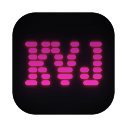

<p align="center">
  
</p>

<h1 align="center">KOVVBOJ</h1>

<p align="center">A layer-based VJ app for live visuals.</p>

<p align="center">
  <a href="https://github.com/kovvbojAV/kovvboj/releases">Download</a> ·
  <a href="#getting-started">Getting started</a> ·
  <a href="docs/architecture.md">Architecture</a> ·
  <a href="CONTRIBUTING.md">Contributing</a>
</p>

KOVVBOJ is an open-source VJ app for macOS, Windows, and Linux. Stack layers of
video, cameras, shaders, and text. Put effects on each layer and on the master
output, then send the result to projectors, LED strips, and lasers.

## Features

- **Layers** — each layer is a source plus an effect chain, with opacity,
  15 blend modes, solo, and mute. Sources include cameras, video files (FFmpeg
  and HAP), images, streams, solid colours, generator shaders, text, and
  NDI, Syphon, and Spout receivers.
- **Shader effects** — load [ISF](https://isf.video) shaders, including many
  converted from Shadertoy and glslsandbox and MadMapper materials. Over 140
  shaders ship with the app. Drag effects between layer and master chains.
- **Two decks** — build two stacks and crossfade between them, with custom ISF
  transitions.
- **Modulation** — drive any parameter from LFOs, audio, MIDI, OSC, or the
  web API. Everything can lock to tempo (Ableton Link,
  Pro DJ Link).
- **Projection mapping** — place surfaces on a stage, corner-pin and warp
  them, and edge-blend projectors that draw several surfaces each.
- **Lighting and lasers** — map video onto addressable LEDs over sACN and
  Art-Net, and render laser materials to a DAC (experimental).
- **Outputs** — windows and projectors, plus NDI, Syphon, Spout, and V4L2
  senders, and recording.

Save your whole setup as a workspace. **File → Export Set** packs a set with
every shader, clip, and image it uses, so you can move it to another machine.

## Getting started

Download a build from [Releases](https://github.com/kovvbojAV/kovvboj/releases),
or build from source. Install Rust and the platform dependencies listed in
[CONTRIBUTING.md](CONTRIBUTING.md#building-from-source), then run this from the
repository root:

```sh
cargo run --release --locked --features projection
```

Use `--all-features` to add NDI, HAP, FFmpeg, Pro DJ Link, the web API,
recording, and laser output. See [Cargo features](CONTRIBUTING.md#cargo-features).

On macOS the downloaded app is ad-hoc signed, not notarized. The first time,
right-click it and choose **Open**.

## Documentation

- [Architecture](docs/architecture.md): how layers, the library, FX chains,
  workspaces, and outputs fit together, and where each one lives in the code.
- [Shader credits](shaders/CREDITS.md): who wrote the bundled shaders, and under
  which licences.
- Design notes: [UI](docs/KOVVBOJ_UI.md), [decks](docs/KOVVBOJ_DECKS.md),
  [release review](docs/KOVVBOJ_RELEASE_REVIEW.md),
  [varda parity](docs/PARITY.md).
- [rustjay-engine guide](https://bluejaylouche.github.io/rustjay-engine/): the
  engine KOVVBOJ runs on, including rendering, modulation, lighting, and
  projection.

## Contributing

See [CONTRIBUTING.md](CONTRIBUTING.md) for build requirements, checks, and a
map of the codebase. Report bugs and suggest improvements in
[GitHub issues](https://github.com/kovvbojAV/kovvboj/issues).

## Credits and license

KOVVBOJ began as a rustjay-engine port of [varda](https://github.com/im-knots/varda)
by im-knots (MIT, see [`LICENSES/varda-MIT.txt`](LICENSES/varda-MIT.txt)). It is
built on [rustjay-engine](https://github.com/BlueJayLouche/rustjay-engine), and
its interface font is [Workbench](https://github.com/jenskutilek/homecomputer-fonts)
(OFL). Bundled shaders carry their own licences, listed in
[`shaders/CREDITS.md`](shaders/CREDITS.md). Some are non-commercial.

KOVVBOJ is licensed under [Apache 2.0](LICENSE-APACHE) or [MIT](LICENSE-MIT),
at your option. Unless you explicitly state otherwise, contributions
intentionally submitted for inclusion are dual licensed under the same terms,
without additional conditions.
