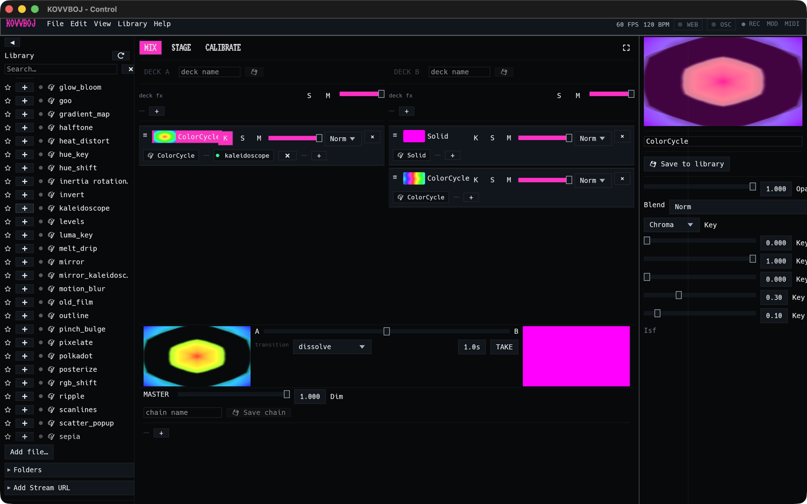
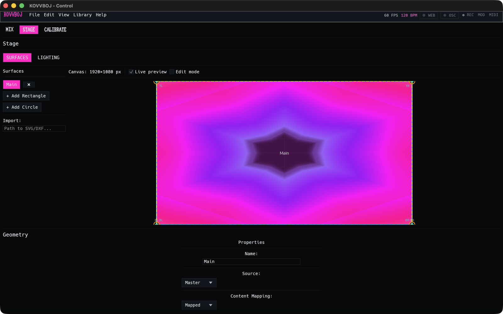

# Getting started

## Install

Download the build for your system from
[Releases](https://github.com/kovvbojAV/kovvboj/releases):

| System | File | Notes |
|---|---|---|
| macOS (Apple silicon) | `kovvboj-macos-arm64.dmg` | Drag KOVVBOJ into Applications. The app is ad-hoc signed, not notarized, so the first time you open it, right-click it and choose **Open**. |
| Windows | `kovvboj-windows-x86_64.msi` | Installs KOVVBOJ and adds a Start-menu shortcut. The `.zip` has the same files if you'd rather not install. |
| Linux (x86-64) | `kovvboj-linux-x86_64.tar.gz` | Unpack it anywhere and run `./kovvboj`. Install your distro's `ffmpeg` package first. It provides the libraries KOVVBOJ needs and the tools it records with. |

NDI is bundled in all three. To build from source instead, see
[CONTRIBUTING](../../CONTRIBUTING.md#building-from-source).

## First launch

KOVVBOJ opens two windows:

- **KOVVBOJ – Control** is where you build and play the set.
- **Projector 1** is the output. It shows what the audience sees. Drag it to
  your projector or second screen, or set it up in
  [Outputs](outputs.md).

The first launch also creates a starter set, with a camera layer and a colour
generator on deck A and a solid colour and another colour generator on deck B.
On macOS, the camera layer makes the system ask for camera access. If you
don't have a camera, or don't want one, delete that layer with its **×**.

### Where your work is saved

Everything you build lives in a **workspace**. A workspace is a folder that
holds your scene, stage, keymap, and saved layers, chains, and decks.

KOVVBOJ uses a `.kovvboj` folder in the directory you started it from if one
exists. Otherwise it uses your user data folder:

| System | Workspace folder |
|---|---|
| macOS | `~/Library/Application Support/KOVVBOJ` |
| Windows | `%APPDATA%\KOVVBOJ` |
| Linux | `~/.local/share/KOVVBOJ` |

The top of the **File** menu shows which workspace is open. From the same menu
you can make new workspaces, open them, and switch between them. Save with
**⌘S** (**Ctrl+S** on Windows and Linux). KOVVBOJ also saves the current set
before it switches workspace.

## The control window

**Top bar.** On the left are the menus: File, Edit, View, Library, and Help.
On the right are the frame rate and tempo, followed by status pills for the
web server (**WEB**) and **OSC**, then **REC**, and then the two map modes,
**MOD** and **MIDI**. See [Modulation](modulation.md).

**Library (left).** This is everything you can play, sorted into groups:

- **DEVICES**: cameras, plus NDI, Syphon, and Spout senders on your network.
- **MEDIA**: images, video files, and streams.
- **GENERATORS**: shaders and built-in sources that make their own picture,
  such as Solid Color and Text.
- **EFFECTS**: shaders that change the picture of the layer below them.

A source row has **A** and **B** buttons, which add it as a new layer on that
deck. An effect row has a **+** button, which adds it to the layer you have
selected. You can also drag effects onto any chain. Search filters every
group, and the ☆ star pins a row to the top of its group. **Add file…**,
**Folders**, and **Add Stream URL** at the bottom bring in your own media.

**Centre.** The centre column has three modes:

- **MIX**: the decks and the master. This is where you play.
- **STAGE**: output surfaces, projection mapping, and lighting placement. See
  [Outputs](outputs.md).
- **CALIBRATE**: camera calibration for LED strips. See
  [Lighting](lighting.md).

In MIX mode, the **⛶** button at the top right hides the library and inspector
so the decks get the whole window. Press **Esc** to bring them back.

**Right.** At the top is a live preview of the master output. Below it is the
**inspector**. Click a layer, a source, or an effect, and the inspector shows
its settings.

## MIX mode at a glance

- **Two decks, A and B.** Each deck has its own FX chain (**deck fx**), solo
  (**S**), mute (**M**), and opacity fader, plus a stack of layers.
- **Layers.** Each layer row shows a thumbnail, the layer name, **K** (key),
  **S** (solo), **M** (mute), an opacity fader, a blend mode (**Norm** by
  default), and **×** to delete it. Under the row is the layer's chain: its
  source, then its effects, then **+** to add another effect.
- **Crossfader.** Below the decks, the fader blends A into B through the
  chosen **transition** (dissolve by default). **TAKE** runs the crossfade to
  the other deck automatically over the time next to it. The keyboard
  shortcut for TAKE is **⌘T**.
- **MASTER.** The master row has a dimmer and the master FX chain, which every
  deck passes through on the way out. **Save chain** keeps the chain in your
  library.

[Decks and layers](decks-and-layers.md) covers all of this in detail.

## Your first set

1. **Pick a layer.** Click a layer's name on deck A. The inspector shows its
   opacity, blend mode, and key.
2. **Add an effect.** Scroll the library to **EFFECTS**, or type a name like
   `kaleidoscope` into the search box, then click the effect's **+**. It
   appears in the layer's chain, and the preview updates straight away. Click
   the effect's chip to adjust it in the inspector. Click the chip's dot to
   bypass it.
3. **Add a layer.** Under **GENERATORS**, click **A** next to any shader. A
   new layer goes on top of deck A. Change its blend mode to layer it over the
   one below.
4. **Build deck B.** Do the same on deck B, so you have something to cut to.
5. **Crossfade.** Drag the A–B fader, or press **TAKE** (**⌘T**) to fade to
   the other deck over the set time.
6. **Send it out.** The Projector 1 window already shows the master. Move it
   to your projector and make it fullscreen, or set it up in
   **View → Outputs**. See [Outputs](outputs.md).
7. **Save.** Press **⌘S**. Next time you launch, KOVVBOJ opens this workspace
   as you left it.

Every set starts with a single surface called **Main**, which shows the master
on the whole canvas, as in the STAGE view above. That's enough for one
projector. For more outputs, mapping, and edge blending, see
[Outputs](outputs.md).

## Undo

**⌘Z** and **⇧⌘Z** undo and redo structural changes: adding, removing, and
reordering layers and effects. Parameter changes aren't undoable. They're
continuous, and MIDI, LFOs, and OSC drive them all the time.
