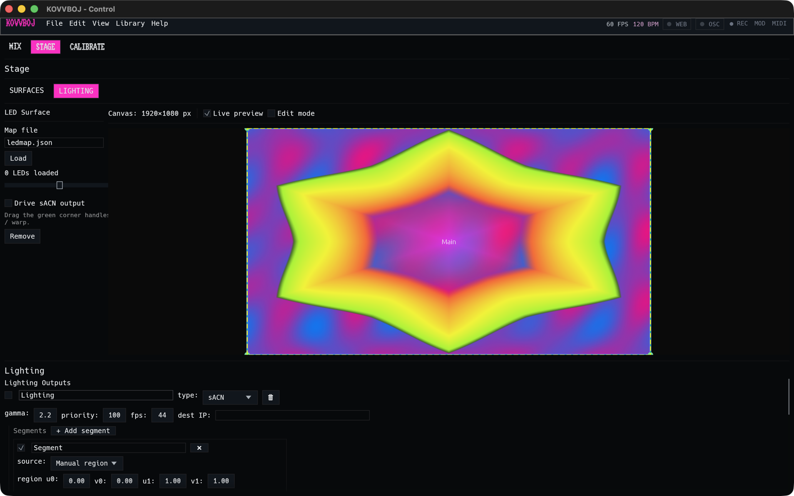

# Lighting

KOVVBOJ can drive lights from the picture: pixel bars, LED strips, and DMX
fixtures. Each light samples the colour at its spot on the stage canvas, and
KOVVBOJ sends the result as DMX over **sACN (E1.31)** or **Art-Net**.

There are two ways to place lights:

- **Lighting outputs with segments** suit fixtures in a known layout: a row
  of pars, a pixel bar, or a grid. You describe where the fixtures sit and how
  they're patched.
- **LED surfaces** suit addressable strips in an arbitrary shape. You find
  each LED's position with a camera in **CALIBRATE**, then play the picture
  back onto them.

Both live in **STAGE → LIGHTING**.

## Lighting outputs and segments

Click **+ Add lighting** under **Lighting Outputs**. An output is one DMX
stream:

| Field | What it does |
|---|---|
| ☑ and name | Turn the output on or off, and name it. |
| **type** | **sACN** or **Art-Net**. |
| **gamma** | Output gamma curve (2.2 by default). LEDs look better with gamma applied. |
| **priority** | sACN priority (100 by default). When several sources send the same universe, the higher priority wins. |
| **fps** | How often to send (44 by default). |
| **dest IP** | Leave it empty to send sACN multicast. Otherwise, put a node's IP here. |

An output holds **segments**, and each segment is a group of fixtures. Click
**+ Add segment** and set:

- **source**: where the segment samples from. **Manual region** is a
  rectangle on the canvas (**u0 v0 u1 v1**, from 0 to 1). Otherwise, pick a
  surface.
- **grid**: the number of fixtures, as columns × rows. A pixel bar of 18 is
  `18 × 1`.
- **scan order**: how the grid is walked into patch order. It sets the corner
  the first fixture sits in, whether rows or columns come first, and
  **serpentine**, where every other row runs back the other way, as most pixel
  mats are wired.
- **profile**: the fixture's channel layout. The built-in profiles are
  **RGB**, **GRB**, **BGR** (3 channels), **RGBW**, **RGB + Dimmer**, and
  **Dimmer + RGB** (4 channels). The full list is under **Fixture Profiles**.
- **start universe** and **start channel**: where the first fixture is
  patched. The rest follow on, using the profile's channel count.
- **colour**: trims applied after gamma. These are brightness, per-channel
  red/green/blue gain, a master dimmer (for fixtures with a dimmer channel),
  the white mode (for RGBW), and optional amber and UV derived from the
  colour.

The segment is drawn on the canvas, so you can see which part of the picture
each fixture takes.

## LED strips: calibrate, then play

Addressable strips (WS281x and similar) behind an sACN or Art-Net pixel
controller have no known position. KOVVBOJ finds each LED with a camera. This
needs a camera, and a build with the `webcam` feature, which the release
builds include.

### 1. Calibrate (CALIBRATE mode)

Point a camera at the strips, then switch the centre column to
**CALIBRATE**. Under **LED Calibration**, set:

| Field | What it's for |
|---|---|
| **LED count** | How many LEDs to map. |
| **Start universe**, **Start channel** | Where the strip is patched. |
| **Color order** | The strip's order, for example RGB or GRB. |
| **On level** | How bright each LED flashes. Lower it if LEDs bloom into their neighbours on camera. |
| **Detect threshold** | How bright a spot has to be to count as the lit LED. |
| **Hold frames** | How long each LED stays lit. Raise it for a slow camera. |
| **Camera index** | Which camera to use. |
| **sACN priority** | The priority the flashes are sent at. |
| **Output file** | Where to save the map (`ledmap.json`). |

Press **▶ Start calibration**. KOVVBOJ first holds every LED off and says
*Hold still — capturing reference…*. It captures the unlit room so it can
subtract it, and after that only the flashing LED shows up. Then it lights
the LEDs one at a time and records where each appears. Keep the camera and
the strips still until it finishes. It saves the map to the output file.

**▶ Start LED output** plays the master onto the strip straight away, which
is a good check that the map is right.

### 2. Play back (LED surface)

In **STAGE → LIGHTING**, click **+ Add LED surface**, type the path of your
map under **Map file**, and click **Load**. It shows how many LEDs loaded.
Drag the green corner handles on the canvas to place and warp the map over
the part of the picture it should show. Tick **Drive sACN output** to send
it.

## Checking your patch

Two things to check when the colours or positions come out wrong:

- **Wrong colours**: the profile or colour order doesn't match the fixture.
  Try GRB for most WS2812 strips.
- **Nothing lights**: check the universe and channel, and whether your node
  wants multicast (empty dest IP) or unicast (its IP). Then check that
  another sender isn't winning on priority.
