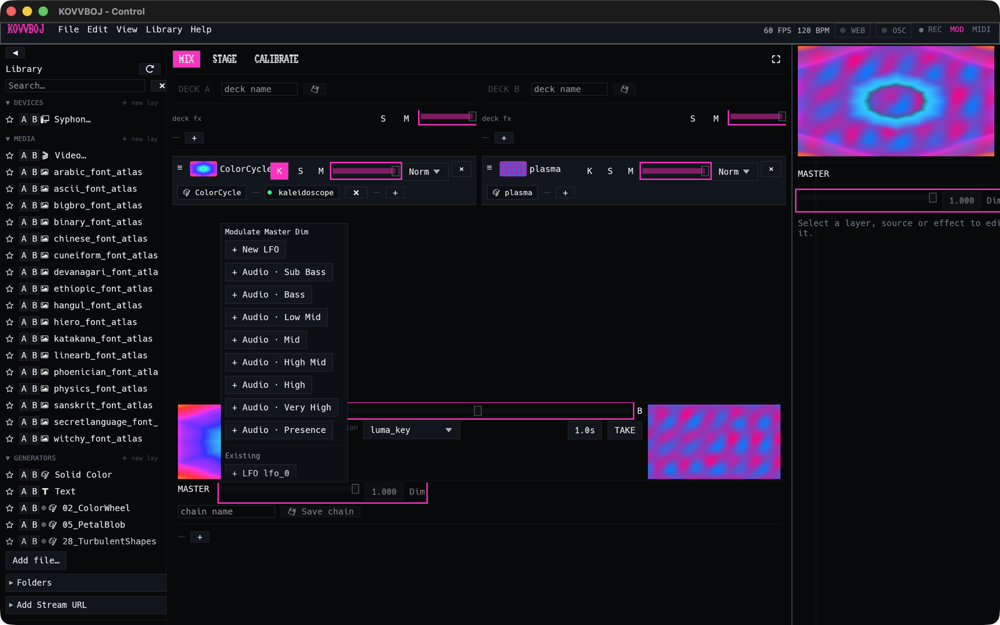

# Modulation

Almost every control in KOVVBOJ is a **parameter**: layer and deck opacity,
the crossfader, the master dimmer, the TAKE time, and every effect control. A
parameter has a base value (where you set the fader). On top of that, any
number of sources can move it:

- **LFOs**: sine, triangle, ramp, saw, and square oscillators, free-running or
  locked to the tempo.
- **Audio**: eight frequency bands of the audio input, from Sub Bass up to
  Presence.
- **MIDI**: a knob, fader, or pad on a controller.
- **OSC** and the **web API**, from other software. See [Control](control.md).

Sources add together. An LFO and an audio band on the same control both move
it, and that's on purpose.

## Map modes

The fastest way to wire things up is with the two map modes at the right of the
top bar: **MOD** and **MIDI**. Switch one on, and every control you can map
gets an outline.

### MOD: LFOs and audio

1. Click **MOD** in the top bar. Mappable controls are outlined in pink.
2. Click a control. A popup opens, titled after the control, for example
   **Modulate Master Dim**.
3. Choose a source:
   - **+ New LFO** makes a new LFO and binds it.
   - **+ Audio · *band*** binds one of the eight bands: Sub Bass, Bass,
     Low Mid, Mid, High Mid, High, Very High, or Presence.
   - Under **Existing**, **+** binds a source you've already made, so one LFO
     can move several controls in step.
4. **Driving this** lists everything already bound to the control, and each
   source's chip lights with its live value. **✖** unbinds that source.
5. Click **MOD** again to leave map mode.

Tune an LFO's shape, rate, depth, and tempo division in **View → Modulation**.
Set the audio input and gain in **View → Audio**.

### MIDI: controller learn

1. Click **MIDI** in the top bar. Mappable controls are outlined in purple.
2. Click a control. It turns orange, which means it's armed.
3. Move a knob, fader, or pad on your controller. The control is bound to it.
4. Click **MIDI** again to leave map mode.

Choose MIDI devices and review or remove bindings in **View → MIDI**.

## Tempo

The top bar shows the current **BPM**. Tempo-synced LFOs, clips, and text
animations all lock to it. It can come from:

- **Ableton Link**: share tempo and phase with Live and other Link apps on the
  network (with the `link` feature).
- **Pro DJ Link**: follow Pioneer CDJs and mixers (with the `prodj` feature).
- **The audio input**: beat detection. This is the default, and it needs
  nothing extra.
- **Tap tempo**: the tap button in **View → Audio**.

Pick the source in **View → Audio**, which also holds the sync settings.

## More detail

The engine guide goes deeper into
[LFOs](https://bluejaylouche.github.io/rustjay-engine/modulation/lfo.html),
[audio routing](https://bluejaylouche.github.io/rustjay-engine/modulation/routing.html),
and [tempo sync](https://bluejaylouche.github.io/rustjay-engine/modulation/tempo-sync.html).
