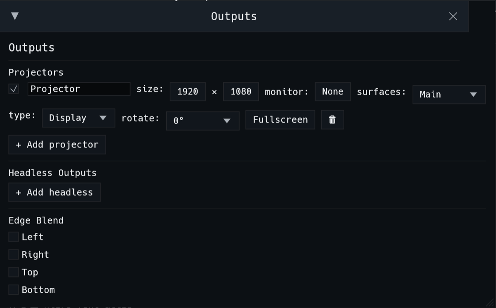

# Outputs

Two things decide where your picture goes:

- **Surfaces**, in STAGE mode. A surface is a shape on the stage canvas that
  shows a source, such as the master, a deck, or a single layer, and can be
  warped to fit a real object.
- **Outputs**, in **View → Outputs**. An output is a projector, a screen, a
  stream, or a recording, and it draws one or more surfaces.

A new set has one surface, **Main**, showing the master across the whole
canvas, and one projector drawing it. For a single projector or screen, that's
all you need.

## The Outputs window

Open it from **View → Outputs**.

### Projectors

Each projector is a window, usually made fullscreen on a projector or monitor.
Its row has:

| Control | What it does |
|---|---|
| ☑ and name | Turn the output on or off, and name it. The window is titled after the name. |
| **size** | The output resolution. |
| **monitor** | Which display to go fullscreen on. |
| **surfaces** | Which surfaces this projector draws. Tick several to build one projector's picture out of several surfaces. |
| **type** | What the output does. See below. |
| **rotate** | Rotate the whole output by 0°, 90°, 180°, or 270°, for a projector mounted on its side. |
| **Fullscreen** | Toggle fullscreen on the chosen monitor. |
| 🗑 | Delete this output. |

**+ Add projector** adds another one.

### Output types

| Type | What it does | Where |
|---|---|---|
| **Display** | Shows the picture in the window (the default). | Everywhere |
| **NDI** | Sends the picture over the network as NDI, named `kovvboj — <name>`. | Everywhere |
| **Syphon** | Shares the picture with other apps on this Mac. | macOS |
| **Spout** | Shares the picture with other apps on this PC. | Windows |
| **V4L2** | Publishes to a V4L2 loopback device, so the output shows up as a webcam. | Linux |
| **Recording** | Records this output to a file. See [Recording](#recording). | Everywhere |

The top bar shows a pill for each sender while it's live.

### Headless outputs

A headless output renders a **surface** without opening a window. Use it to
send a surface over NDI, Syphon, or Spout, or to record it, without using a
screen. **+ Add headless** adds one. Each has its own on/off tick, size,
**surface**, and **type**.

### Edge blend

With two or more overlapping projectors, tick the sides that overlap under
**Edge Blend** (Left, Right, Top, Bottom) to fade them into each other. Each
ticked side gets a **width** (how far the fade reaches) and a **γ** (gamma), to
even out the brightness where the two projectors overlap. Edge
blending runs on the projector's finished picture, after warping, so the
overlap lines up with what the projector actually throws.

## STAGE mode: surfaces

Switch the centre column to **STAGE**. The **SURFACES** tab lists your
surfaces and shows the canvas. **LIGHTING** places LED fixtures on the same
canvas (see [Lighting](lighting.md)).

- **+ Add Rectangle** and **+ Add Circle** add surfaces. To import shapes, type
  the path to an SVG or DXF file under **Import**.
- **Canvas** shows the canvas size in pixels. Every surface is placed in those
  pixels.
- **Live preview** shows the real output on the canvas. **Edit mode** lets you
  drag surfaces and their corners.

Select a surface to edit it under **Geometry**:

- **Name.**
- **Source**: what the surface shows. That's **Master** (the finished mix), a
  single deck or layer, or **Domemaster** for fisheye dome output.
- **Content mapping**:
  - **Fill** stretches the source over the surface on its own.
  - **Mapped** uses the surface's place on the canvas to decide which part of
    the source it shows. Several Mapped surfaces then tile one picture between
    them, which is how you spread one image across several objects or
    projectors.
- **Warp**: **Corner Pin** drags four corners to fit a flat surface seen at an
  angle. **Mesh** gives a grid of points for curved or uneven surfaces.

## Recording

Record in either of two ways:

- **REC** in the top bar records the master. Click it again to stop. It also
  stops every output that's recording.
- An output with type **Recording** records just that output.

Set the codec and folder in **Edit → Settings → Recording**:

- **Codec**: H.264, H.265, AV1, or ProRes 422. ProRes records to `.mov`.
- **Folder**: by default, a `recordings/` folder inside the open workspace, so
  recordings stay with their set. **Choose folder…** sends every set's
  recordings somewhere else.

The settings apply to every set, starting with the next recording.

> **FFmpeg.** Recording runs the `ffmpeg` program. The macOS and Windows
> packages include it. On Linux, install your distro's `ffmpeg` package.

## Deck windows

With the `projection` feature, click a deck's preview under the crossfader to
pop that deck out into its own window. Use this for a preview monitor, or to
send one deck somewhere on its own.
